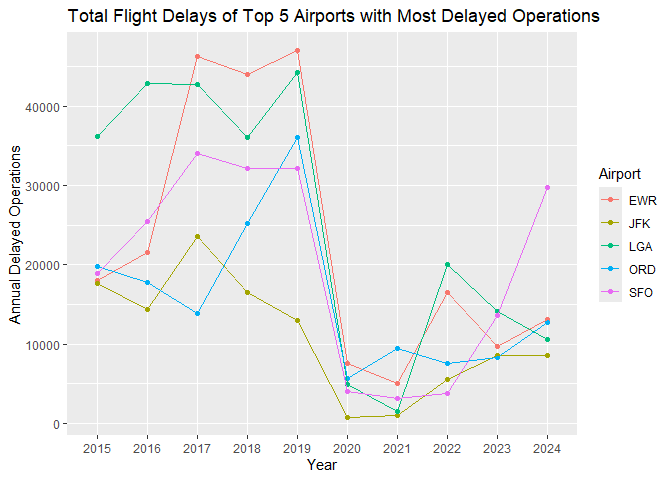

# Scraping Capacity Numbers from Wikipedia

    library(tidyverse)

    ## Warning: package 'tidyverse' was built under R version 4.5.2

    ## Warning: package 'ggplot2' was built under R version 4.5.2

    ## Warning: package 'tidyr' was built under R version 4.5.2

    ## Warning: package 'readr' was built under R version 4.5.2

    ## Warning: package 'purrr' was built under R version 4.5.2

    ## Warning: package 'stringr' was built under R version 4.5.2

    ## Warning: package 'forcats' was built under R version 4.5.2

    ## Warning: package 'lubridate' was built under R version 4.5.2

    ## ── Attaching core tidyverse packages ──────────────────────── tidyverse 2.0.0 ──
    ## ✔ dplyr     1.1.4     ✔ readr     2.1.5
    ## ✔ forcats   1.0.1     ✔ stringr   1.5.2
    ## ✔ ggplot2   4.0.0     ✔ tibble    3.3.0
    ## ✔ lubridate 1.9.4     ✔ tidyr     1.3.1
    ## ✔ purrr     1.1.0     
    ## ── Conflicts ────────────────────────────────────────── tidyverse_conflicts() ──
    ## ✖ dplyr::filter() masks stats::filter()
    ## ✖ dplyr::lag()    masks stats::lag()
    ## ℹ Use the conflicted package (<http://conflicted.r-lib.org/>) to force all conflicts to become errors

    library(rvest)

    ## Warning: package 'rvest' was built under R version 4.5.2

    ## 
    ## Attaching package: 'rvest'
    ## 
    ## The following object is masked from 'package:readr':
    ## 
    ##     guess_encoding

    # This Wikipedia page has 31 US Large Hub Airports and capacity numbers from 2015-2024
    page <- read_html("https://en.wikipedia.org/wiki/List_of_the_busiest_airports_in_the_United_States")

    capacity <- page %>% html_element(xpath='//*[@id="mw-content-text"]/div[2]/table[1]') %>% html_table()
    colnames(capacity) <- c("Rank","Name","Airport","Cities","Metro Area","State","2024","2023","2022","2021","2020","2019","2018","2017","2016","2015")

    # Select only IATA Code and The Capacity Numbers by Year
    capacity <- capacity[,c(3,7:16)] %>% as.data.frame()
    capacity %>% head()

    ##   Airport       2024       2023       2022       2021       2020       2019
    ## 1     ATL 52,511,402 50,950,068 45,396,001 36,676,010 20,559,866 53,505,795
    ## 2     DFW 42,351,316 39,246,212 35,345,138 30,005,266 18,593,421 35,778,573
    ## 3     DEN 40,012,895 37,863,967 33,773,832 28,645,527 16,243,216 33,592,945
    ## 4     ORD 38,575,693 35,843,104 33,120,474 26,350,976 14,606,034 40,871,223
    ## 5     LAX 37,760,834 40,956,673 32,326,616 23,663,410 14,055,777 42,939,104
    ## 6     JFK 31,466,102 30,804,355 27,154,885 15,273,342  8,269,819 31,036,655
    ##         2018       2017       2016       2015
    ## 1 51,865,797 50,251,964 50,501,858 49,340,732
    ## 2 32,821,799 31,816,933 31,283,579 31,589,839
    ## 3 31,362,941 29,809,097 28,267,394 26,280,043
    ## 4 39,873,927 38,593,028 37,589,899 36,305,668
    ## 5 42,624,050 41,232,432 39,636,042 36,351,272
    ## 6 30,620,769 29,533,154 29,239,151 27,782,369

# Bring in Flight Delay Data from 2015 to 2024

    delay <- read.csv("delay_core_2015_2024.csv")
    delay <- delay %>% filter(Year%in%c("2015","2016","2017","2018","2019","2020","2021","2022","2023","2024"))

    top10 <- delay %>% group_by(Loc) %>%
      summarise(Total.Delays=sum(Tot.Delays)) %>%
      arrange(desc(Total.Delays))
    top10$Loc[1:10]

    ##  [1] "LGA" "EWR" "SFO" "ORD" "JFK" "LAX" "LAS" "DFW" "BOS" "PHL"

    top10

    ## # A tibble: 30 × 2
    ##    Loc   Total.Delays
    ##    <chr>        <int>
    ##  1 LGA         253372
    ##  2 EWR         228849
    ##  3 SFO         197128
    ##  4 ORD         156422
    ##  5 JFK         109345
    ##  6 LAX         106876
    ##  7 LAS         105991
    ##  8 DFW          94198
    ##  9 BOS          82595
    ## 10 PHL          76603
    ## # ℹ 20 more rows

Top 10 Airports with the Most Total Delays from 2015-2024:

1.  LGA (NY)
2.  EWR (NJ)
3.  SFO (CA)
4.  ORD (IL)
5.  JFK (NY)
6.  LAX (CA)
7.  LAS (NV)
8.  DFW (TX)
9.  BOS (MA)
10. PHL (PA)

<!-- -->

    onlytop5 <- delay %>% filter(Loc %in% top10$Loc[c(1:5)])
    ggplot(onlytop5,aes(x=Year,y=Tot.Delays,color=Loc,group=Loc)) + 
      geom_point() +
      geom_line() +
      labs(title="Total Flight Delays of Top 5 Airports with Most Delayed Operations",
           y = "Annual Delayed Operations",
           color = "Airport")

